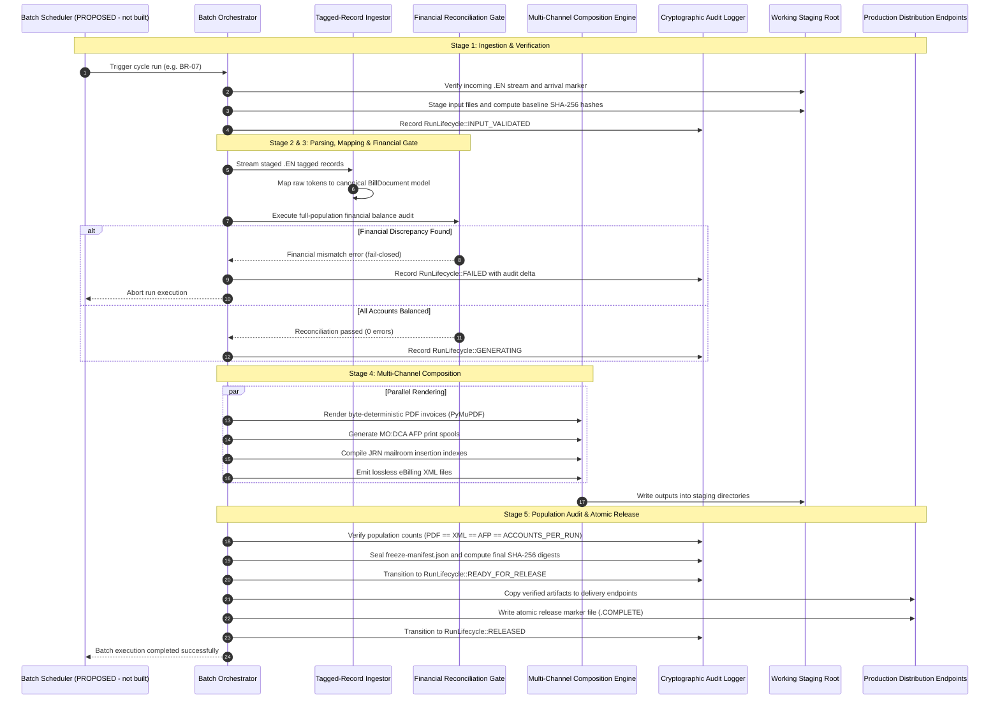
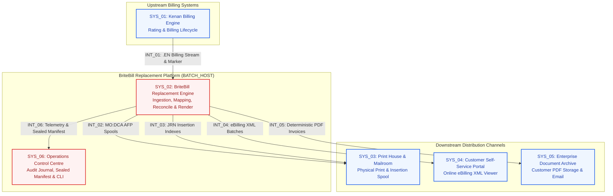
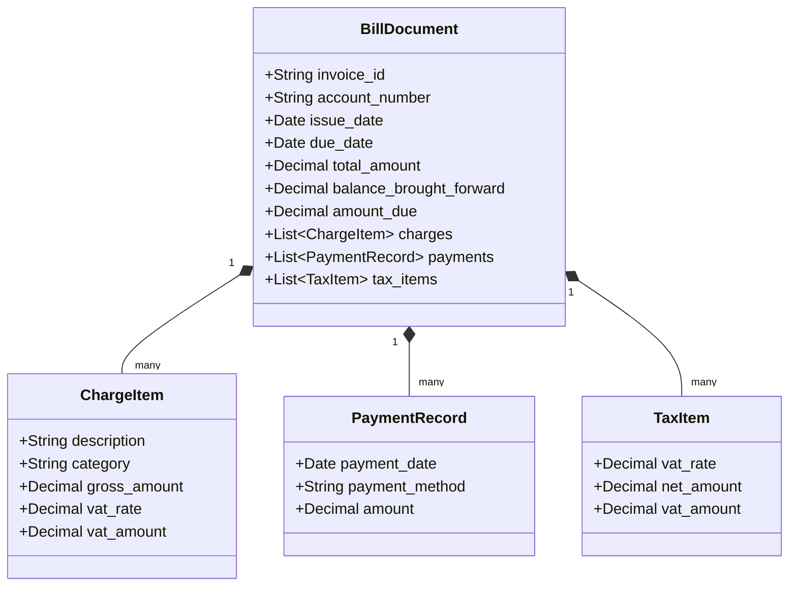

<!--
GOLD STANDARD for the hld skill. Match its structure, heading numbering, diagram types and
styling, ID schemes (SYS_nn, INT_nn, REQ-nn) and table columns exactly.
ACCOUNTS_PER_RUN, BATCH_HOST, PDF_TOTAL and SECONDARY_SCHEDULES stand in for real, measured
figures and names in the source HLD; they are withheld here only. A generated HLD must state
the REAL number or name in every such place - never a placeholder, never a vague 'many'.
Exact figures are what make the SLA and parity claims checkable.
-->

# High-Level Architecture (HLA): BriteBill Replacement Platform

## 1. Executive Summary

### 1.1 Initiative Goal
The BriteBill Replacement Platform replaces the proprietary third-party BriteBill invoice composition system used for fixed-line customer billing. 

This platform achieves the following primary business goals:
- It eliminates third-party licensing costs, proprietary dependencies, and vendor software lock-in.
- It provides a locally controlled, deterministic, and auditable composition engine.
- It delivers high-throughput batch generation for four recurring monthly billing cycles: `BR-07`, `BR-14`, `BR-21`, and `BR-28`.
- It processes approximately `<ACCOUNTS_PER_RUN>` customer accounts per billing run within a four-hour service level agreement (SLA) window.
- It simultaneously produces four synchronized output channels from a single canonical document model: Customer PDF, Print Spool AFP, Mailroom Index JRN, and Digital Portal XML.
- It guarantees full financial integrity through mandatory, fail-closed automated reconciliation gates.

### 1.2 Solution Architecture Summary
The solution operates as a standalone Python-based batch processing engine deployed on the dedicated batch host `<BATCH_HOST>`. It processes raw Kenan billing stream files (`.EN`), executes financial reconciliation, and renders customer-facing outputs. The engine isolates every run in an immutable staging directory, verifies cryptographic checksums, and publishes outputs atomically only after all financial and population gates pass.

### 1.3 Business Value & Operational Outcomes
- **Cost Reduction**: Complete decommissioning of third-party composition licenses.
- **Operational Autonomy**: Full internal control over document templates, business rules, and legal notices.
- **Audit Defensibility**: Cryptographic sealing of every batch run with complete provenance manifests and append-only event journals.
- **Financial Compliance**: Zero-tolerance reconciliation preventing billing discrepancies between rated data and rendered customer invoices.

---

## 2. Project Context and Scope

### 2.1 Background
Fixed-line customer billing produces monthly invoices across four staggered billing cycles. The legacy composition workflow relied on an external vendor system (BriteBill). This introduced high annual licensing costs and operational delays whenever regulatory or template changes occurred. The BriteBill Replacement Platform moves invoice composition entirely onto internal infrastructure using high-performance open standards.

### 2.2 Scope

#### 2.2.1 In Scope
- Ingestion of raw `.EN` tagged-record stream files generated by the upstream Kenan billing engine.
- Syntactic and structural validation of incoming batch streams with marker-file arrival detection.
- Transformation of raw stream records into an immutable, strongly typed canonical domain model.
- Full-population financial reconciliation covering invoice totals, line item aggregates, tax breakdowns, and balance brought forward.
- Version-controlled template selection and date-effective static legal content resolution.
- High-performance direct-draw PDF rendering using PyMuPDF with byte-level determinism.
- High-speed print spool generation using MO:DCA AFP binary encoding.
- Print house journal index generation for postal insertion and mailroom tracking.
- Lossless structured XML generation for online customer self-service portals.
- Run-level cryptographic manifest creation and append-only event journaling.
- Atomic publication to destination endpoints with isolated staging and late-arriving release markers.

#### 2.2.2 Out of Scope
- Upstream rating, charging, or billing account balance calculation performed by Kenan.
- Direct management or control of physical print-house insertion machinery and postal sorters.
- Real-time customer web serving; online portals ingest published outputs asynchronously.
- Probabilistic, generative, or Large Language Model (LLM) components in the financial generation path.

### 2.3 Architecture Boundaries and Key Assumptions
- **Deterministic Processing**: All calculations and document renderings produce identical, byte-reproducible outputs for identical inputs.
- **Local Filesystem Isolation**: Network-isolated execution on `<BATCH_HOST>` with zero runtime external API or HTTP dependencies.
- **Fail-Closed Operations**: Any financial discrepancy, unmapped record, or population count mismatch immediately halts the run and prevents output release.

---

## 3. Solution Approach and Workflow

### 3.1 Operational Process Flow

The batch execution pipeline operates across five consecutive stages governed by a strict nine-state finite state machine (`RunLifecycle`):
`RECEIVED` -> `INGESTING` -> `INPUT_VALIDATED` -> `GENERATING` -> `VALIDATING` -> `RECONCILING` -> `READY_FOR_RELEASE` -> `PUBLISHING` -> `RELEASED`.


### 3.2 End-to-End Operational Sequence Diagram

The sequence diagram below illustrates the batch execution sequence from cycle trigger through atomic publication:



---

## 4. Solution Architecture Landscape

### 4.1 Solution Design and Architecture

The solution landscape connects the upstream billing rating engine, the core batch transformation platform, and downstream customer presentation and physical print channels.



### 4.2 Applications and Components Overview

The table below catalogs all systems and platforms within the solution boundary:

| ID | Application / Component | Application Type | Description | Impacted |
|---|---|---|---|---|
| `SYS_01` | Kenan Billing Engine (Amdocs) | Billing / Rating | Upstream rating engine producing periodic `.EN` billing stream files. | No |
| `SYS_02` | BriteBill Replacement Composition Engine | Batch Engine | Core batch orchestration, mapping, financial reconciliation, and multi-channel rendering engine. | Yes |
| `SYS_03` | External Print House & Mailroom Spool | Print Production | Commercial printing facility ingesting MO:DCA AFP spools and JRN insertion records. | No |
| `SYS_04` | Customer Digital Self-Service Portal | Web Portal | Customer billing portal ingesting structured eBilling XML for web presentation. | No |
| `SYS_05` | Enterprise Document Archive & Dispatcher | Document Repository | Long-term customer communications repository and email dispatcher ingesting certified PDF invoices. | No |
| `SYS_06` | Operations Control Centre & Audit Journal | Ops & Governance | Operational monitoring CLI, telemetry aggregator, and sealed run manifest validator. | Yes |

#### 4.2.1 SYS_01: Kenan Billing Engine (Amdocs)
The Kenan engine calculates customer monthly billing totals, rating, and payment adjustments. At cycle close, Kenan exports raw `.EN` tagged-record stream files to the staging transfer area.

#### 4.2.2 SYS_02: BriteBill Replacement Composition Engine
The core processing component implemented in Python. It executes local staging, canonical data mapping, strict financial reconciliation, and parallel document rendering.

#### 4.2.3 SYS_03: External Print House & Mailroom Spool
Receives binary MO:DCA AFP print spools and JRN insertion index files for postal sorting, physical paper printing, envelope inserting, and mail dispatch.

#### 4.2.4 SYS_04: Customer Digital Self-Service Portal
The customer-facing digital web application that parses structured XML invoice streams to present interactive online bill breakdowns.

#### 4.2.5 SYS_05: Enterprise Document Archive & Dispatcher
The central document store that ingests byte-deterministic PDF files for permanent customer record retention and automated email bill dispatch.

#### 4.2.6 SYS_06: Operations Control Centre & Audit Journal
The administrative command-line and operational tooling suite used to trigger batch runs, monitor state transitions, verify cryptographic checksums, and inspect audit logs.

### 4.3 Interfaces

The table below details all communication interfaces across the platform boundary:

| ID | Type / Protocol | From | To | Description | Connectivity |
|---|---|---|---|---|---|
| `INT_01` | SFTP / SMB File Feed | `SYS_01` | `SYS_02` | Kenan tagged-record billing stream (`.EN`) and cycle marker file. | Existing Connectivity |
| `INT_02` | Secure File Transfer | `SYS_02` | `SYS_03` | MO:DCA AFP binary print stream partitioned at source-EN granularity. | New Connectivity |
| `INT_03` | Secure File Transfer | `SYS_02` | `SYS_03` | Tabular ASCII index files (`.JRN`) containing mailroom insertion records. | New Connectivity |
| `INT_04` | Secure File Transfer | `SYS_02` | `SYS_04` | Lossless structured XML documents matching customer portal schema. | New Connectivity |
| `INT_05` | Secure File Transfer | `SYS_02` | `SYS_05` | Certified, byte-deterministic PDF customer invoices. | New Connectivity |
| `INT_06` | Local File / JSONL | `SYS_02` | `SYS_06` | Append-only execution journal, telemetry events, and sealed manifest. | New Connectivity |

#### 4.3.1 INT_01: Kenan Billing Stream & Completion Marker
Transfers raw `.EN` data files containing account records, billing headers, charge breakdowns, and payment histories. A completion marker file signals batch completeness.

#### 4.3.2 INT_02: MO:DCA AFP Print Spools
Delivers structured binary AFP spools formatted for high-speed commercial printers. Each AFP file corresponds to an upstream input batch.

#### 4.3.3 INT_03: JRN Mailroom Insertion Indexes
Delivers ASCII index files specifying sheet counts, account identifiers, envelope barcodes, and selective advertising insert triggers.

#### 4.3.4 INT_04: eBilling XML Batches
Transfers schema-validated XML documents containing invoice data for online customer self-service viewing.

#### 4.3.5 INT_05: Deterministic PDF Invoices
Transfers byte-deterministic PDF documents containing vector brand artwork, billing transaction tables, and Giro payment slips.

#### 4.3.6 INT_06: Telemetry & Sealed Manifest
Emits structured JSONL telemetry and a cryptographic `release_manifest.json` sealing file counts, execution parameters, and SHA-256 hashes.

### 4.4 Primary Production Execution Surfaces
The platform provides administrative command-line surfaces for operations and scheduling:
- `python -m src.cli run --cycle BR-07`: Executes an end-to-end scheduled batch run.
- `python -m src.cli verify --run-id <ID>`: Validates stage outputs and cryptographic manifests.
- `python -m src.cli reconcile --run-id <ID>`: Executes standalone full-population financial audits.
- `python -m src.cli status`: Queries active pipeline state, worker progress, and memory utilization.

### 4.5 Auxiliary and Operational Audit Surfaces
- **Freeze Manifests**: `<working_root>/<run_id>/<attempt_id>/manifests/freeze-manifest.json` locks template versions, configuration files, and legal text snapshots before rendering starts.
- **Release Manifests**: `<working_root>/<run_id>/<attempt_id>/manifests/release_manifest.json` contains cryptographic SHA-256 hashes for all generated output files.
- **Execution Evidence**: `<working_root>/<run_id>/<attempt_id>/evidence/` contains test logs, financial reconciliation summaries, and output population audits.

---

## 5. High-Level Data and Storage Architecture

### 5.1 Host & Working Storage Topology
The engine executes entirely within a dedicated local filesystem hierarchy on the dedicated batch host `<BATCH_HOST>`. Every batch run is isolated by unique run and attempt identifiers:

```
<working_root>/<run_id>/<attempt_id>/
├── input/                  # Immutable local copy of source .EN files
├── staging/                # Active rendering and composition working directory
│   ├── pdf/                # Rendered PDF files
│   ├── xml/                # Generated eBilling XML files
│   ├── afp/                # Generated MO:DCA AFP print spools
│   └── jrn/                # Generated JRN insertion journals
├── output/                 # Ready-for-release consolidated output artifacts
├── manifests/              # Frozen configuration, effective hashes, and audit logs
│   ├── content.yml         # Frozen legal and marketing text snapshot
│   ├── effective-config.json
│   └── freeze-manifest.json
└── evidence/               # Automated test reports, parity logs, and execution evidence
```

### 5.2 Canonical Domain Entity Model

The domain entity model enforces type safety and monetary precision across all transformation steps:



### 5.3 Multi-Channel Output Volume & Specifications
Production metrics established during candidate certification (ATT-006 baseline):
- **PDF Documents**: `<PDF_TOTAL>` total PDF files (`<ACCOUNTS_PER_RUN>` primary invoices + `<SECONDARY_SCHEDULES>` secondary itemized schedules).
- **XML Documents**: `<ACCOUNTS_PER_RUN>` structured customer eBilling files.
- **AFP Spools**: 32 consolidated MO:DCA print files matching the 32 upstream Kenan input batches.
- **JRN Journals**: 32 postal index files containing 100% field parity with postal insertion machinery.

---

## 6. Security Architecture and Controls

The platform security architecture adheres to strict controls defined in `docs/SECURITY_AND_PRIVACY.md`:

### 6.1 Hardened Parsing & Processing Controls
- **XML Security**: `ingestion/xml_reader.py` disables external entity resolution (`resolve_entities=False`), network access (`no_network=True`), and DTD loading. Any incoming document containing a `DOCTYPE` declaration is rejected immediately. Input file size is capped at 10 MiB to prevent memory exhaustion attacks.
- **Output Escaping**: The Jinja2 rendering environment enforces `autoescape=True` unconditionally. File loaders are confined to approved template directories to prevent path traversal attacks.

### 6.2 Zero Runtime Network Access
- No module within `ingestion/`, `mapping/`, `templating/`, or `rendering/` initiates external HTTP or network requests during generation.
- All fonts, styling assets, and configuration templates reside locally on disk on `<BATCH_HOST>`.

### 6.3 Working Storage Path Isolation & Traversal Defense
- File discovery resolves candidate paths and rejects any file whose resolved parent directory escapes the staging root.
- Output filenames derive from validated invoice identifiers using a strict alphanumeric pattern (`[A-Za-z0-9._-]`). Path traversal attempts are rejected immediately.

### 6.4 Privacy and Audit Redaction
- Domain models override string representations to redact personal customer names and street addresses from log outputs.
- Upstream customer metadata categories (`FIRSTNAME`, `EMAIL`, `OFFNETID`, `EIRCODE`) are dropped during ingestion mapping.
- Audit manifests record only source file basenames, billing reference numbers, and one-way SHA-256 correlation identifiers.

---

## 7. Architecture Traceability Matrix

### 7.1 Architecture Traceability Matrix

| Requirement | Description | Component Implementation | Verification Control |
|---|---|---|---|
| `REQ-01` | Ingest Kenan `.EN` tagged-record streams | `SYS_02` (`ingestion/en_reader.py`) | Automated parser unit tests and zero-failure batch validation. |
| `REQ-02` | Strong financial reconciliation | `SYS_02` (`reconciliation/checks.py`) | Full-population balance reconciliation gate (`reconcile()`). |
| `REQ-03` | Byte-deterministic PDF rendering | `SYS_02` (`rendering/mupdf_renderer.py`) | SHA-256 byte-identity verification against certified baseline. |
| `REQ-04` | Multi-channel parity (PDF/XML/AFP/JRN) | `SYS_02` (`mapping/*`, `rendering/*`) | Cross-output population count verification (`<ACCOUNTS_PER_RUN>` exact). |
| `REQ-05` | Atomic release & staging isolation | `SYS_02` (`batch/orchestrator.py`) | Zero output visibility before `READY_FOR_RELEASE` and marker written last. |
| `REQ-06` | Auditability & run sealing | `SYS_06` (`audit/manifest.py`) | Cryptographic `release_manifest.json` generation. |

---

## 8. Appendix

### 8.1 Terms and Definitions

| Term | Definition |
|---|---|
| `.EN` | Proprietary tagged-record flat file format emitted by the Kenan billing engine. |
| AFP | Advanced Function Presentation / MO:DCA binary print architecture used in industrial mailrooms. |
| JRN | Journal insertion index file coordinating automated paper folding and envelope stuffing. |
| Byte Determinism | The guarantee that identical inputs rendered with identical parameters yield identical binary SHA-256 hashes. |
| Fail-Closed | An architectural principle where any detected inconsistency aborts processing before releasing outputs. |

### 8.2 Reference Documents
- `britebill-replacement/README.md`: System operational runbook and architecture overview.
- `britebill-replacement/docs/SECURITY_AND_PRIVACY.md`: Security controls and privacy safeguards.
- `britebill-replacement/docs/PRODUCTION_CANDIDATE_ATT006.md`: Candidate certification report and benchmark results.
