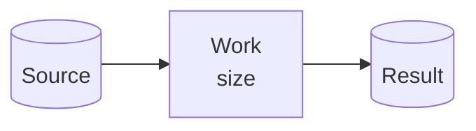
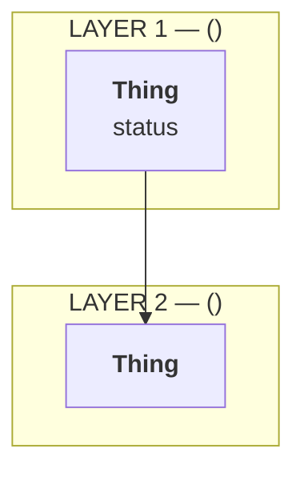
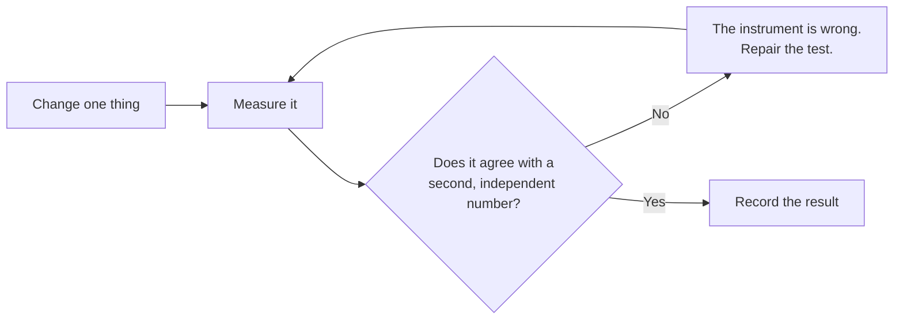
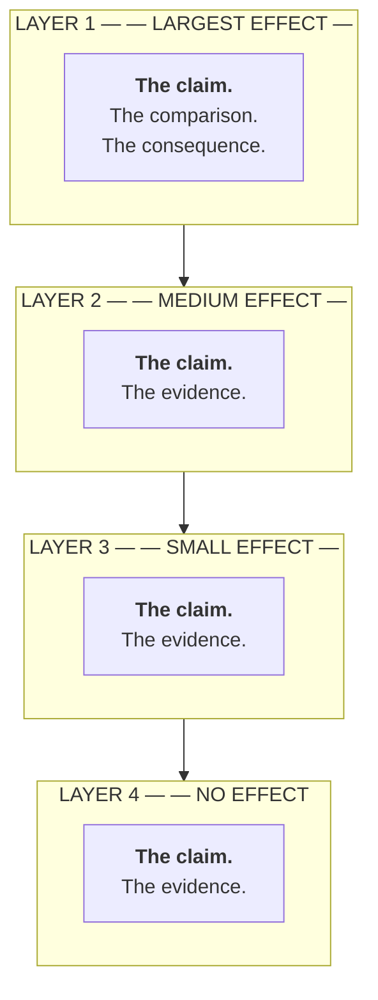
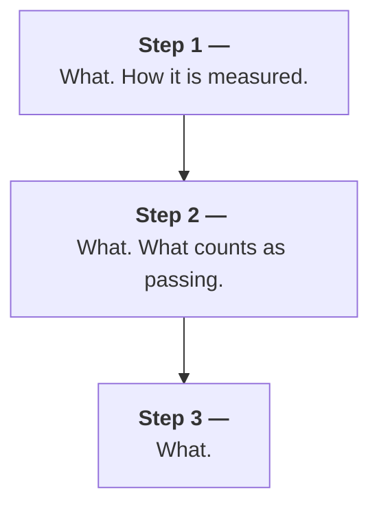

<!--
  tech-explainer skeleton. Copy, fill, delete what has nothing to say.
  Slots marked [KEEP] are what make this an explainer rather than a summary.
  Rename any section to fit the domain — keep the order.
  If the repo requires document frontmatter, add it above the title (type: analysis).
-->

# \<The subject\> — a plain explainer

<!-- No name given? Use the role — "the engineering manager" — and leave this placeholder visible.
     Never invent a name. -->
**Audience:** \<name or role of the reader\>, and anyone who did not do the \<testing / investigation / migration\>.
**Written in Simplified Technical English.** Short sentences. One idea per sentence.

---

## 1. Why this document exists  [KEEP]

This document explains \<n\> things:

1. \<question 1\>
2. \<question 2\>
3. \<question 3\>

Section \<n\> answers the \<the reader's own question\> directly.

---

## 2. Words used in this document  [KEEP]

Use these words with one meaning only.

| Word       | Meaning                                          |
| ---------- | ------------------------------------------------ |
| **\<term\>** | \<one meaning, in plain words, no new jargon\>  |

<!-- 8-12 rows. Highest value: terms two people in the thread have used differently. -->

---

## 3. What we are building

\<Two or three sentences. What the system does and why it exists.\>



\<The physical facts: hardware, operating system, versions, scale.\>

---

## 4. The goal, in numbers  [KEEP]

<!-- No agreed target? Retitle "The result, in numbers" and make the missing target the finding. -->

\<One sentence stating the target.\>

| Item                    | Value       |
| ----------------------- | ----------- |
| \<basis\>               | \<value\>   |
| **\<what we need\>**    | **\<n\>**   |
| **\<what we measure\>** | **\<n\>**   |
| **Gap**                 | **\<n x\>** |

<!-- If an earlier target has changed, say so and say why. -->

---

## 5. The layers — and \<the reader's specific question\>

**Short answer: \<the answer, in one or two sentences\>.**

\<Then earn it.\>



\<One line: which layer is easy to change, which layer decides the outcome.\>

### \<The options compared\>

| Option | What it adds | What is inside | Do we use it? |
| ------ | ------------ | -------------- | ------------- |
|        |              |                |               |

---

## 6. Why the work took so long — what we withdrew

<!-- Nothing withdrawn? Do NOT invent a retraction. Substitute "What this rests on": the assumptions
     the argument depends on, each with what would falsify it. Same function — it shows the reader
     where to attack. -->

\<n\> wrong results were found. **Every one was found by comparing a number against a second,
independent number.**



- We reported \<claim\>. **This was wrong.** \<Cause, and what caught it.\>
- We reported \<claim\>. **This was wrong.** \<Cause, and what caught it.\>

**Lesson:** \<one line\>.

---

## 7. Where the \<time / cost / data\> goes

We measured \<n\> samples.

```mermaid
pie showData
    title <what is being divided>
    "<slice A>" : 0
    "<slice B>" : 0
```

\<The consequence: what this means for where effort should go.\>

---

## 8. What limits the result — \<n\> layers  [KEEP — the most important diagram]

This is the most important diagram in this document. The layers are in order of size of effect.



**Read the diagram this way.** If we change \<the small layer\>, we gain \<small\>. If we change
\<the big layer\>, we gain \<big\>. \<Layer n\> is where the work must go.

---

## 9. \<n\> recommendations — what we checked

<!-- No formal list of recommendations? The reader still holds a belief. State it as they would
     state it, then check it: claim / verdict / evidence. -->

We checked all \<n\> against our own measurements and against public evidence.

| #   | Recommendation | Result | Evidence |
| --- | -------------- | ------ | -------- |
| 1   |                |        |          |

### Where the advice is right

\<Steelman. Concede what is genuinely true, with the arithmetic.\>

```
<quantity>            <value>
<quantity>            <value>
Theoretical maximum   <value>
Measured              <value>   (<percent>)
```

### Why \<the alarming number\> is not as bad as it looks

| System                  | Result |
| ----------------------- | ------ |
| \<independent source\>  |        |
| **\<ours\>**            |        |

**Conclusion: \<one sentence\>.**

---

## 10. What \<the constraint\> costs us, and what it gives us

### The cost

| Option | Supported? | Note |
| ------ | ---------- | ---- |
|        |            |      |

### What it does not cost us

\<The belief people hold, checked. State plainly whether the evidence supports it.\>

### What it gives us

\<The genuine benefit. Every constraint has one; naming it proves you are not just complaining.\>

---

## 11. What we do next  [KEEP]



**Step \<n\> is the most important step.** \<Why, with the number.\>

We also have \<n\> measurement gaps to close:

1. \<What we never measured directly, and how long the direct check would take.\>

---

## 12. Questions for \<the reader\>

These would help us. \<Reader\> has more experience with \<the area\>.

1. **\<Question?\>** \<Why the answer would change what we do.\>

---

## 13. Summary in five lines  [KEEP]

1. \<target vs measured vs gap\>
2. \<the main cause\>
3. \<the thing the reader thought was the cause, with its measured size\>
4. \<the constraint, and what it really costs\>
5. \<the next step\>

---

## Related documents

| Document | What it holds |
| -------- | ------------- |
| [`path`](path) | \<the detail this explainer deliberately leaves out\> |
