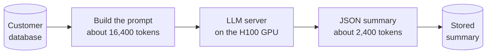
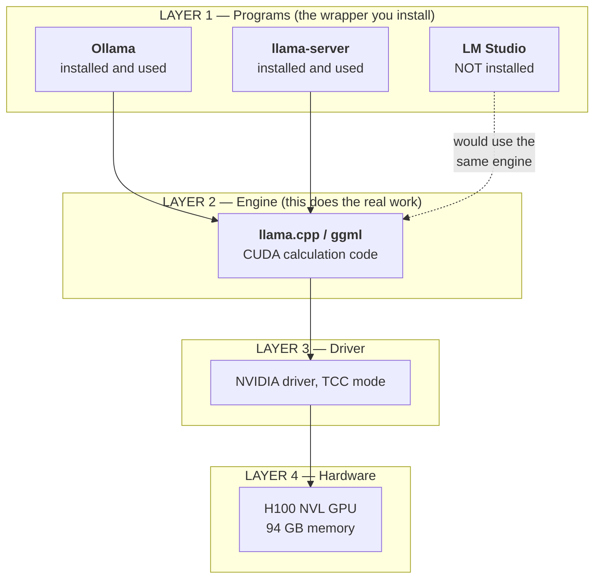
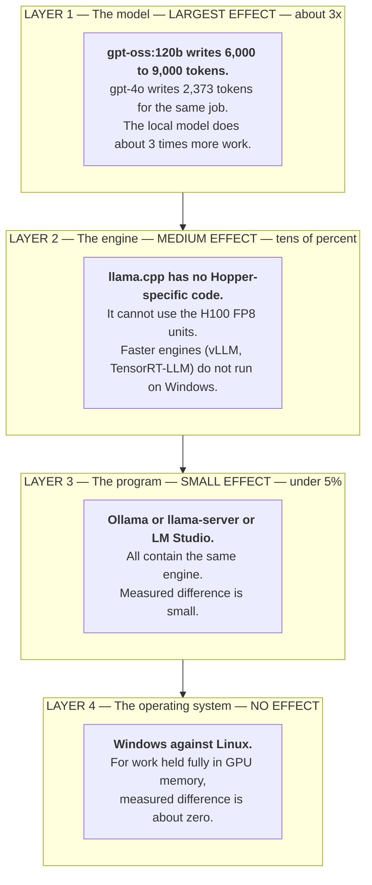
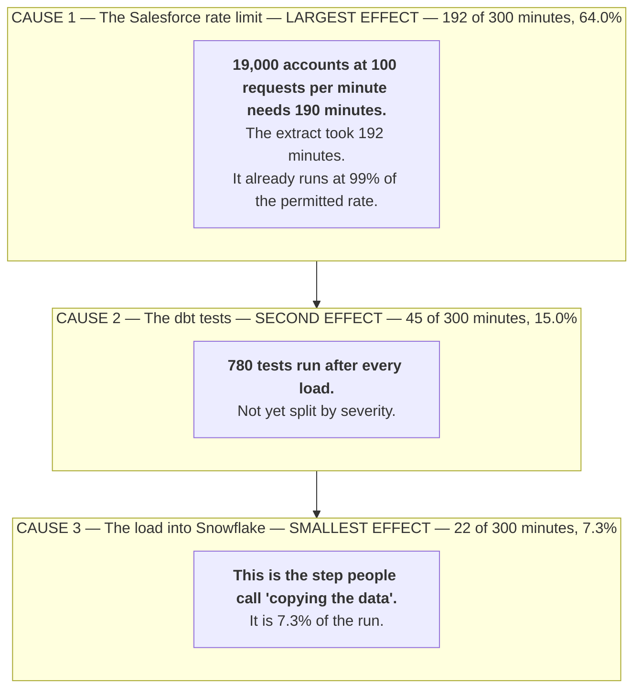
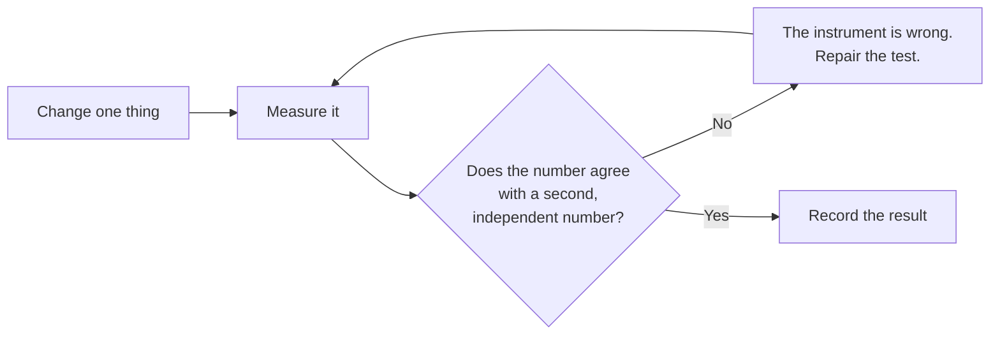
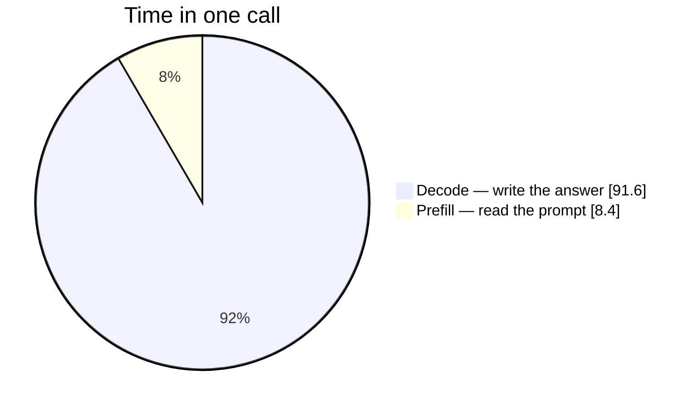
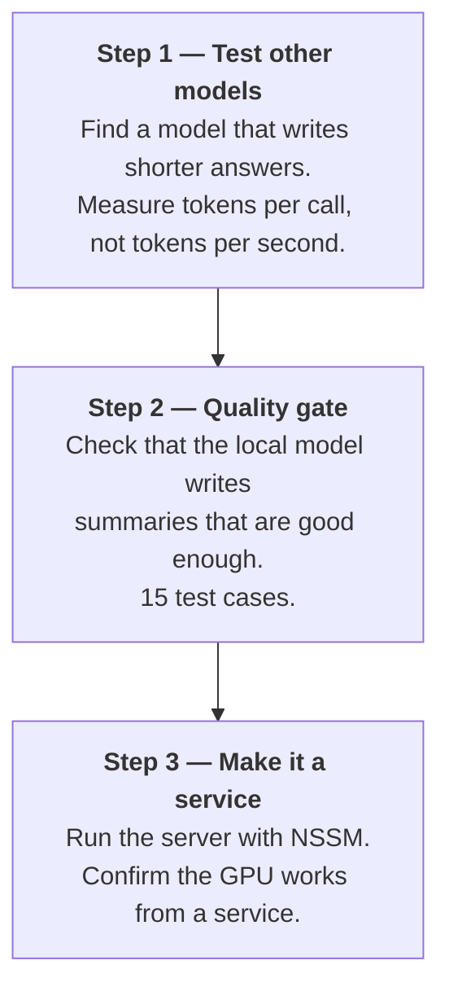

# Diagram vocabulary for explainers

Four Mermaid patterns cover almost every explainer. Reusing a small set is deliberate: the reader
learns the visual grammar once, in §3, and reads every later diagram faster because of it. A document
where each diagram is a different Mermaid type makes the reader re-learn the notation five times.

## Contents

- [Rule zero: does this diagram earn its place?](#rule-zero-does-this-diagram-earn-its-place)
- [Pattern 1 — the pipeline (`flowchart LR`)](#pattern-1--the-pipeline-flowchart-lr)
- [Pattern 2 — the layer stack (`flowchart TB` + subgraphs)](#pattern-2--the-layer-stack-flowchart-tb--subgraphs)
- [Pattern 3 — the ranked-effect diagram (the important one)](#pattern-3--the-ranked-effect-diagram-the-important-one)
- [Pattern 4 — the check loop](#pattern-4--the-check-loop)
- [Pattern 5 — proportion (`pie showData`)](#pattern-5--proportion-pie-showdata)
- [Pattern 6 — the next-steps chain](#pattern-6--the-next-steps-chain)
- [Syntax notes that bite](#syntax-notes-that-bite)

## Rule zero: does this diagram earn its place?

Delete the diagram if a table says it better. Diagrams carry **shape and relationship**; tables carry
**detail and comparison**. A diagram listing five options with three attributes each is a table drawn
badly.

Four to six diagrams across a long document is right. Every one should answer a different question.

## Pattern 1 — the pipeline (`flowchart LR`)

For §3, "what we are building". Left to right, one path, database shapes for stores. Put the size of
the data on the arrows or in the nodes — the reader's first question about a pipeline is "how big".

````markdown

````

Keep it to five or six nodes. A pipeline diagram with fifteen boxes is an architecture diagram, and
the reader stops tracing it.

## Pattern 2 — the layer stack (`flowchart TB` + subgraphs)

For §5, "what sits on what". One subgraph per layer, numbered and named. Peers go side by side inside
their layer with `direction LR`. Mark what you do **not** have — the absence is often the reader's
actual question.

````markdown

````

Two techniques here do real work:

- **The dotted arrow with a label** (`C -.->|"would use the same engine"| D`) shows a hypothetical
  without asserting it exists. This is how you answer "what if we used X?" inside the diagram.
- **The parenthetical in each subgraph title** ("the wrapper you install", "this does the real work")
  tells the reader what the layer *is for*, which is what they actually lack.

Follow the diagram with the one-line consequence: *"Layer 1 is easy to change. Layer 2 decides the
speed."*

## Pattern 3 — the ranked-effect diagram (the important one)

For §8, "what limits the result". This is the diagram the document exists to deliver. It is the layer
stack again, but **ordered by size of effect and labelled with the magnitude**.

````markdown

````

Construction rules:

- **Title format:** `LAYER n — <the thing> — <EFFECT SIZE IN CAPS> — <the number>`. The caps and the
  number are what the reader takes away; the layer number just keeps the ordering legible.
- **Node body:** bold first line = the claim. Following lines = the evidence and the comparison. Three
  lines per node is the ceiling.
- **The arrows mean rank, not flow.** `L1 --> L2 --> L3 --> L4` reads as descending importance. Say so
  in the sentence above the diagram so nobody reads it as a data path.
- **Include the reader's preferred fix even when it ranks last.** Omitting it looks like evasion;
  ranking it with a measured number is the argument.
- **A layer you did not measure says so** — "NOT MEASURED" is an honest rank. An invented one is the
  fastest way to lose the reader who happens to know that layer.

Always follow it with the reading instruction:

> **Read the diagram this way.** If we change the program (Layer 3), we gain a few percent. If we
> change the model (Layer 1), we can gain about 3 times. Layer 1 is where the work must go.

### The same move outside the "stack" case

Nothing here depends on the causes forming a real stack. When they do not, call them causes and rank
them by measured share — the diagram does exactly the same job:

````markdown

````

Note the third node: the reader's own mental model ("it's just copying data") is named and ranked
rather than dismissed. That is the move, in one box.

## Pattern 4 — the check loop

For §6, "why the work took so long" — the procedure that catches bad results. A decision diamond with
a failure branch that loops back.

````markdown

````

The loop-back arrow is the content. It shows that the failure path is normal and expected, which is
what makes the withdrawn-results list read as rigour instead of incompetence.

## Pattern 5 — proportion (`pie showData`)

For §7, "where the time goes". Use it when the reader is about to optimise the small slice.

````markdown

````

- `showData` prints the values — always use it; an unlabelled pie is a decoration.
- Up to five slices. Above five, use a table — the labels stop fitting and the small slices become
  indistinguishable. If the natural breakdown is four or five stages, the pie is still the right
  visual; do not split it artificially.
- **Say what the numbers are drawn from**, in the sentence above: a sample count where you have one
  (*"We measured 223 samples of each stage"*), otherwise the single run and its date (*"From the run
  of 2026-08-06"*). A one-run pie is honest as long as it says it is one run — a pie with no stated
  basis is the single easiest thing in the document to misquote.
- Follow with the consequence: *"Earlier work tried to make prompt reading faster. That work can only
  improve 8.4% of the time."*

## Pattern 6 — the next-steps chain

For §11. Numbered steps, top to bottom, each with its method and its acceptance in the node.

````markdown

````

Name the step that matters most immediately below, with the reason: *"Step 1 is the most important
step. The model decides about 3 times the work. No change to the server software can equal that."*

## Syntax notes that bite

| Need                    | Write                                        | Note                                                                 |
| ----------------------- | -------------------------------------------- | -------------------------------------------------------------------- |
| Line break in a node    | `<br/>`                                      | Not `\n`. Renderers differ on `<br>` without the slash.              |
| Bold inside a node      | `["<b>Claim.</b><br/>Evidence."]`            | Markdown `**` does not render inside Mermaid nodes.                  |
| Any label with punctuation | Wrap in double quotes: `A["a, b: c"]`     | Unquoted `(`, `,`, `:`, `-` break the parser.                        |
| Database / store shape  | `DB[("Customer<br/>database")]`              |                                                                      |
| Decision                | `C{"Does it agree?"}`                        |                                                                      |
| Hypothetical / optional | `C -.->|"would use"| D`                      | Dotted = does not exist today.                                       |
| Peers side by side      | `direction LR` inside the `subgraph`         | Without it, subgraph children stack vertically.                      |
| Subgraph with a title   | `subgraph id["The title text"]`              | The bare form `subgraph The title` mangles punctuation.              |

Check every diagram renders before shipping — a broken Mermaid block shows the reader raw source and
costs more credibility than the diagram was worth. In order of preference:

1. **Paste into `mermaid.live`** — authoritative, and it points at the failing line.
2. **VS Code / GitHub / GitLab preview** — all render every pattern above.
3. **If you are offline**, read each block against the table above. Nearly every failure is one of
   four things: an unquoted label containing `(`, `,`, `:` or `-`; a `<br>` without the slash;
   markdown `**bold**` inside a node; or a `subgraph` title that is not bracketed and quoted.

Do not ship a diagram you have not checked by one of these three.
